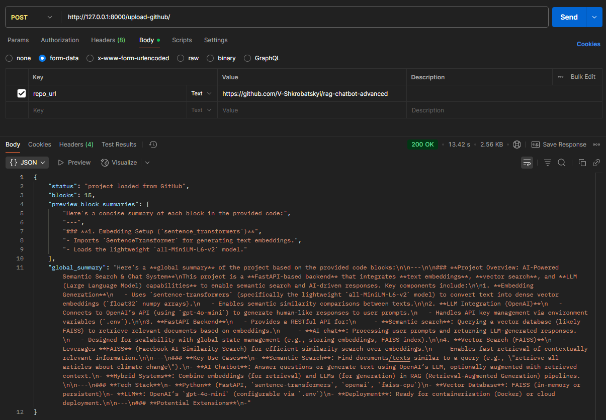
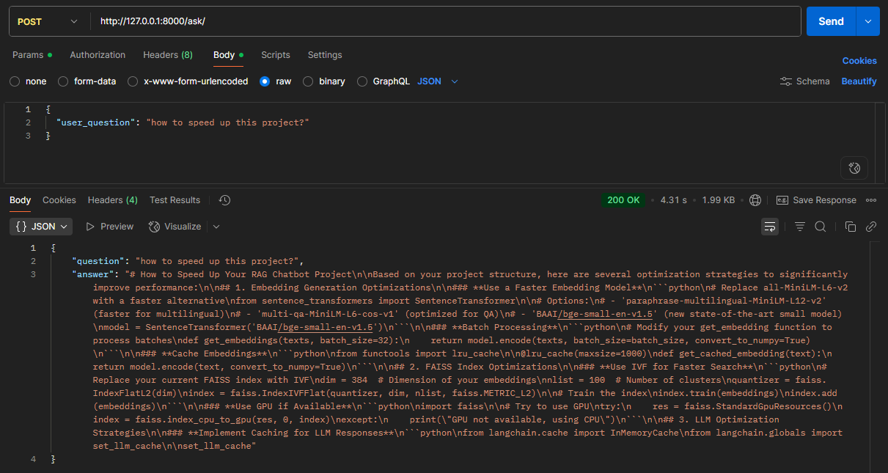
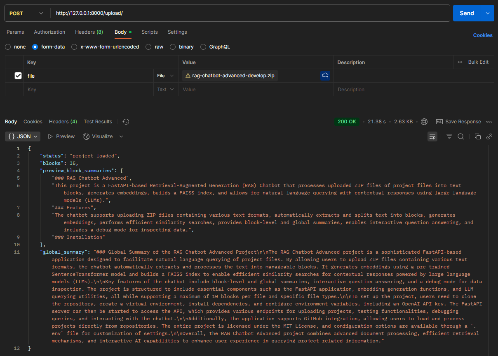
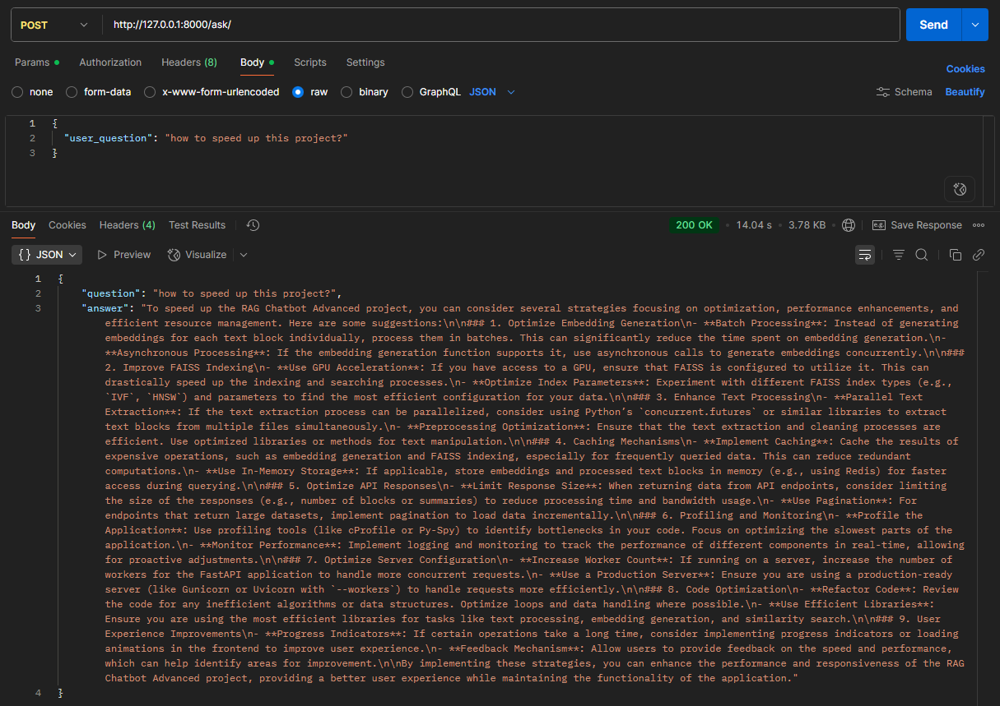

# RAG Chatbot Advanced

A **Retrieval‑Augmented Generation (RAG) Chatbot** built with FastAPI.  
It allows you to:

- Upload ZIP archives with project files or load projects directly from a GitHub repository URL  
- Process them into text chunks, generate embeddings, and build a FAISS index  
- Search across relevant chunks and the global project summary  
- Use different LLMs, including **OpenAI** and **Mistral**, to generate answers

---

## Features

- Load a project via ZIP (`.py`, `.txt`, `.md`) **or** directly from GitHub URL  
- Automatic text chunking  
- Embedding generation for each chunk  
- FAISS index construction for fast retrieval  
- Local (per‑chunk) and global project summarization via LLMs  
- Debug mode for exploring chunks and embeddings without summaries  
- Support for multiple LLMs, including Mistral  
- Interactive API endpoints for previews, block inspection, and question answering  

---

## Installation

1. Clone the repository:

   ```bash
   git clone git@github.com:V-Shkrobatskyi/rag-chatbot-advanced.git
   cd rag-chatbot-advanced
   ```

2. Create and activate a virtual environment:

   ```bash
   python -m venv venv
   source venv/bin/activate   # Linux / macOS
   venv\Scripts\activate      # Windows
   ```

3. Install dependencies:

   ```bash
   pip install -r requirements.txt
   ```

4. Create a `.env` file

   - Copy `.env.sample` to `.env`
   - Set required environment variables (API keys, options, etc.)
   - Make sure to include API keys for the LLMs you want to use (OpenAI, Mistral, etc.)  

---

## Usage

```bash
uvicorn main:app --host 0.0.0.0 --port 8000
```

API will be available at: `http://127.0.0.1:8000`

---

## API Endpoints

| Method | Path | Description |
|---|---|---|
| **POST** `/upload/` | Upload a ZIP file | Process files → embeddings → FAISS index → summaries |
| **POST** `/upload-debug/` | Same as `/upload/` but in debug mode (no summaries, only raw chunks info) |
| **POST** `/upload-github/` | Load a project from GitHub by URL | Fetch repo → process → embeddings → FAISS index → summaries |
| **GET** `/test-read/` | Preview first chunks | Returns a few text chunks for inspection |
| **POST** `/debug-query/` | Run a query without LLM answer | Useful for analyzing selected chunks |
| **POST** `/ask/` | Ask a question with context | Returns an answer using the global summary + relevant chunks |

---

## LLM Support

The system supports multiple LLMs, including:

- OpenAI (e.g., GPT‑3, GPT‑4)  
- **Mistral** (choose via environment configuration)  
- New models can be easily added through `llm_utils.py`

---

## Project Structure

```
main.py                # FastAPI application with endpoints
embeddings.py          # Embedding generation functions
llm_utils.py           # LLM interface (OpenAI, Mistral, etc.)
github_loader.py       # (new) GitHub URL project loader
tmp_uploads/           # Temporary storage for ZIP or GitHub content
stored_blocks/         # Saved text chunks
global_summary.txt     # Global project summary
.env.sample            # Example environment configuration
requirements.txt       # Dependencies
.gitignore
```

---

## Configuration

Example `.env` file:

```ini
OPENAI_API_KEY=your_openai_key_here
MISTRAL_API_KEY=your_mistral_key_here
MAX_BLOCKS_PER_FILE=10
SUPPORTED_FILE_EXTENSIONS=.py,.txt,.md
# Other options: chunk size, LLM model, timeouts, etc.
```

---

## Examples

- Upload a ZIP project and ask questions  
- Load a GitHub repository by URL and quickly explore it  
- Use the Mistral model for answers if configured  

---

## License

MIT License  

---

## Examples with Postman (from 2025-09-15)

### 1. Upload project (v1 of this project) directly from a GitHub repository URL with using Mistral (mistral-large-latest):


Ask "how to speed up this project?":


### 2. Upload ZIP archives with project files (v1 of this project) with using OpenAI (gpt-4o-mini):


Ask "how to speed up this project?":

